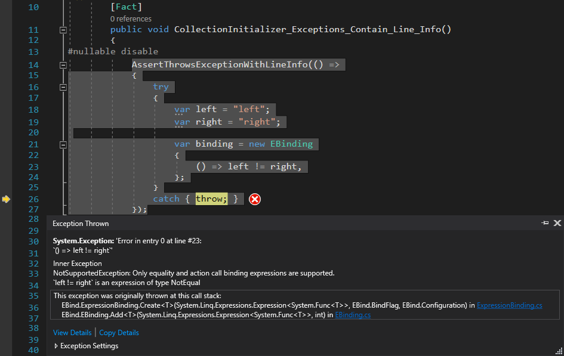

<p align="center">
  <br>
  <br>
  <br>
  <a href="https://github.com/SIDOVSKY/EBind/actions/workflows/ci.yml">
    
  </a>
  <a href="https://www.nuget.org/packages/EBind.NET/">
    
  </a>
  <a href="https://www.nuget.org/packages/EBind.LinkerIncludeGenerator/">
    
  </a>
  <a href="https://codecov.io/gh/SIDOVSKY/EBind">
    
  </a>
</p>

<!-- snippet: Bind -->
<a id='snippet-bind'></a>
```cs
var binding = new EBinding
{
    () => view.Text == vm.Text,
    () => view.Text == vm.Description.Title.Text,
    () => view.Text == (vm.Text ?? vm.FallbackText),
    () => view.Visible == !vm.TextVisible,
    () => view.Visible == (vm.TextVisible == vm.ImageVisible),
    () => view.Visible == (vm.TextVisible && vm.ImageVisible),
    () => view.Visible == (vm.TextVisible || vm.ImageVisible),
    () => view.FullName == $"{vm.FirstName} {vm.LastName}",
    () => view.FullName == vm.FirstName + " " + vm.LastName,
    () => view.Timestamp == Converter.DateTimeToEpoch(vm.DateTime),

    BindFlag.TwoWay,
    () => view.Text == vm.Text,
    () => view.SliderValueFloat == vm.AgeInt,

    BindFlag.OneTime | BindFlag.NoInitialTrigger,
    () => view.ShowImage(vm.ImageUri),
    () => Dispatcher.RunOnUiThread(() => view.ShowImage(vm.ImageUri)),

    BindFlag.OneTime,
    (view, nameof(view.Click), vm.OnViewClicked),
    (view, nameof(view.TextEditedEventHandler), () => vm.OnViewTextEdited(view.Text)),
    (view, "CustomEventForGesture", vm.OnViewClicked),

    (view, nameof(view.Click), vm.ViewClickCommand),
    (view, nameof(view.Click), () => vm.ViewClickCommand.TryExecute(view.Text)),

    new UserExtensions.CustomEBinding(),
};

binding.Dispose();
```
<sup><a href='/EBind.Tests/Snippets/Sample.cs#L64-L98' title='Snippet source file'>snippet source</a> | <a href='#snippet-bind' title='Start of snippet'>anchor</a></sup>
<!-- endSnippet -->

### Three types of bindings here

* <a id='equality'>**EQUALITY**</a> – bind a property or an expression of them to another property.  
  Every change of every property on the right (`vm.Text`) leads to an assignment of the property on the left (`view.Text`).  
  Binding between two properties may work in a Two-Way mode.
  ```cs
  () => view.Text == vm.Text,
  ```
* <a id='action'>**ACTION**</a> – bind a method to its target and parameters.  
  Every time `vm.ImageUri` is changed `view.ShowImage` is invoked with a new value.
  ```cs
  () => view.ShowImage(vm.ImageUri),
  ```
* <a id='event'>**EVENT**</a> – bind a method or command to an event.  
  Every time `view.Click` is raised `vm.OnViewClicked` is called.
  ```cs
  (view, nameof(View.Click), vm.OnViewClicked),
  ```

### Key points

- <a name="main-update-trigger"></a>
  **The main binding update trigger is [`INotifyPropertyChanged.PropertyChanged`](https://docs.microsoft.com/dotnet/api/system.componentmodel.inotifypropertychanged.propertychanged)**.  
  Boilerplate code may be avoided with [Fody.PropertyChanged](https://github.com/Fody/PropertyChanged).  
  There are some platform-specific [pre-configured triggers](#pre-configured-triggers). Additional ones are easy to [configure](#member-triggers).

- **Bindings invoke immediately after the construction, except for the [event binding](#event).**  
  To skip initial invocation prepend `BindFlag.NoInitialTrigger`.

- **Each property and field in a binding expression triggers the binding update**  
  

- **Default binding mode is One-Way, Source-to-Target (right to left).**  
  This is the most common use-case. Explicit declaration of a two-way mode will help to avoid unreasonable performance loss.  
  May be overridden in `EBinding.DefaultConfiguration.DefaultFlag`.

- **For Target-to-Source binding simply swap operands.**  
  It seems more natural than bringing in an additional `BindFlag.OneWayToSource`.

- **Expressions of any complexity are supported.**  
  Even MONSTERS like that:
  ```cs
  () => view.Text == new Func<string?>(() => new Dictionary<string, string?>((int)10.0){ { "Key", vm.Text } }["Key"])(),
  ```
  However, the more complex the expression, the longer it takes to create and invoke the binding from it. See [benchmarks](#benchmark-ebind-creation) for the reference.

- **`BindFlag` applies to all subsequent bindings till the next flag.**

## Configuration and Extensibility

### Pre-Configured Triggers

<details><summary>Xamarin.Android</summary>

  | View/Control                  | Event           | Property                                           |
  |-------------------------------|-----------------|----------------------------------------------------|
  | Android.Views.View            | Click           |                                                    |
  |                               | LongClick       |                                                    |
  |                               | FocusChange     |                                                    |
  | Android.Widget.AdapterView    | ItemSelected    | SelectedItemPosition                               |
  |                               | ItemClick       |                                                    |
  |                               | ItemLongClick   |                                                    |
  | Android.Widget.CalendarView   | DateChange      | Date                                               |
  | Android.Widget.CompoundButton | CheckedChange   | Checked                                            |
  | Android.Widget.DatePicker     | DateChanged     | DateTime                                           |
  | Android.Widget.NumberPicker   | ValueChanged    | Value                                              |
  | Android.Widget.RatingBar      | RatingBarChange | Rating                                             |
  | Android.Widget.SearchView     | QueryTextChange | Query                                              |
  | Android.Widget.SeekBar        | ProgressChanged | Progress                                           |
  | Android.Widget.TextView       | TextChanged     | Text                                               |
  | Android.Widget.TimePicker     | TimeChanged     | Hour (API 23+)<br>Minute (API 23+)<br>CurrentHour<br>CurrentMinute |
</details>

<details><summary>Xamarin.iOS</summary>

  | View/Control       | Event                  | Property        |
  |--------------------|------------------------|-----------------|
  | UIBarButtonItem    | Clicked                |                 |
  | UIControl          | TouchUpInside          |                 |
  |                    | ValueChanged           |                 |
  | UIDatePicker       | ValueChanged           | Date            |
  | UIPageControl      | ValueChanged           | CurrentPage     |
  | UISearchBar        | TextChanged            | Text            |
  | UISegmentedControl | ValueChanged           | SelectedSegment |
  | UISlider           | ValueChanged           | Value           |
  | UIStepper          | ValueChanged           | Value           |
  | UISwitch           | ValueChanged           | On              |
  | UITabBarController | ViewControllerSelected | SelectedIndex   |
  | UITextField        | EditingChanged         | Text            |
  |                    | EditingDidBegin        |                 |
  |                    | EditingDidEnd          |                 |
  | UITextView         | Changed                | Text            |
</details>

<details><summary>Xamarin.Forms</summary>

  All views implement `INotifyPropertyChanged` so the [main trigger](#main-update-trigger) is invoked for every bindable property change. 
</details>

### Member Triggers

In `Configuration` you may specify how to subscribe and unsubscribe for signals of property and field updates that are not tracked out of the box.  
There are overloads for the property/field update handler as `System.EventHandler`, `System.EventHandler<TEventArgs>` or any other class:

<!-- snippet: Configure-Member-Trigger -->
<a id='snippet-configure-member-trigger'></a>
```cs
EBinding.DefaultConfiguration.ConfigureTrigger<View, string>(
    v => v.Text,
    (v, h) => v.TextEditedEventHandler += h,
    (v, h) => v.TextEditedEventHandler -= h);

EBinding.DefaultConfiguration.ConfigureTrigger<View, View.TextEditedEventArgs, string>(
    v => v.Text,
    (v, h) => v.TextEditedGenericEventHandler += h,
    (v, h) => v.TextEditedGenericEventHandler -= h);

EBinding.DefaultConfiguration.ConfigureTrigger<View, Action<string>, string>(
    v => v.Text,
    trigger => _ => trigger(),
    (v, h) => v.TextEditedCustomEventHandler += h,
    (v, h) => v.TextEditedCustomEventHandler -= h);
```
<sup><a href='/EBind.Tests/Snippets/Sample.cs#L17-L33' title='Snippet source file'>snippet source</a> | <a href='#snippet-configure-member-trigger' title='Start of snippet'>anchor</a></sup>
<!-- endSnippet -->

### Event Triggers

You may configure your own triggers for [event bindings](#event) under custom identifiers even if they represent a Pub-Sub pattern differently from C# events (`IObservable`, `Add/RemoveListener` methods).

<!-- snippet: Configure-Custom-Event-Trigger -->
<a id='snippet-configure-custom-event-trigger'></a>
```cs
EBinding.DefaultConfiguration.ConfigureTrigger<View, View.GestureRecognizer>(
    "CustomEventForGesture",
    trigger => new View.GestureRecognizer(trigger),
    (v, h) => v.AddGestureRecognizer(h),
    (v, h) => v.RemoveGestureRecognizer(h));
```
<sup><a href='/EBind.Tests/Snippets/Sample.cs#L53-L59' title='Snippet source file'>snippet source</a> | <a href='#snippet-configure-custom-event-trigger' title='Start of snippet'>anchor</a></sup>
<!-- endSnippet -->

The same identifier (event name) can be used with multiple classes.  
For example on Xamarin.iOS a [pre-defined](/EBind/Platform/Configuration.ios.cs#LC56:~:text=void%20ConfigureExtraEvents(),%7D) `Tap` event can be used with both `UIControl` and `UIView`:
```cs
using EBind;
using static EBind.Platform.Configuration.ExtraEventNames;

var binding = new EBinding
{
    (uiButton, Tap, OnButtonClick),
    (uiImageView, Tap, OnImageClick),
};
```

Configuration of C# events is **not required** – they can be found by the name: `nameof(obj.Event)`.  
But it's recommended to specify subscription and unsubscription delegates to improve cold-start performance and avoid [linker errors](#linking).

<!-- snippet: Configure-Event-Trigger -->
<a id='snippet-configure-event-trigger'></a>
```cs
EBinding.DefaultConfiguration.ConfigureTrigger<View>(
    nameof(View.TextEditedEventHandler),
    (v, h) => v.TextEditedEventHandler += h,
    (v, h) => v.TextEditedEventHandler -= h);

EBinding.DefaultConfiguration.ConfigureTrigger<View, View.TextEditedEventArgs>(
    nameof(View.TextEditedGenericEventHandler),
    (v, h) => v.TextEditedGenericEventHandler += h,
    (v, h) => v.TextEditedGenericEventHandler -= h);

EBinding.DefaultConfiguration.ConfigureTrigger<View, Action<string>>(
    nameof(View.TextEditedCustomEventHandler),
    trigger => _ => trigger(),
    (v, h) => v.TextEditedCustomEventHandler += h,
    (v, h) => v.TextEditedCustomEventHandler -= h);
```
<sup><a href='/EBind.Tests/Snippets/Sample.cs#L35-L51' title='Snippet source file'>snippet source</a> | <a href='#snippet-configure-event-trigger' title='Start of snippet'>anchor</a></sup>
<!-- endSnippet -->

Event triggers configured for a class are available to all its children unless they have their own variation defined.

Triggers may be overwritten by onward setups including the pre-defined ones.

### Binding Dispatcher

Sometimes ViewModel properties are set from the background thread that leads to data-binding view update triggering in the non-ui thread.

Establishing a proper thread switching in place is not possible for some code. Also, the risk of missing a thread is not acceptable or not worth caring about for some projects, and delegation of this problem is a good deal.  
In this case, data-binding as a point of integration may be a good place to switch threads between the ui-threaded View and the thread-insensitive ViewModel layers.

Dispatchers which force the UI thread are set up in `Configuration`:
```cs
EBinding.DefaultConfiguration.AssignmentDispatchDelegate = Dispatcher.RunOnUiThread;
EBinding.DefaultConfiguration.ActionDispatchDelegate = Dispatcher.RunOnUiThread;
```

For Xamarin platform [`Xamarin.Essentials.MainThread.BeginInvokeOnMainThread`](https://docs.microsoft.com/en-us/xamarin/essentials/main-thread) will be the best option most of the time.

### Custom Bindings

EBinding collection initializer accepts any form of `IEBinding`.  
By implementing this simple interface you can create your own binding types and adapters for data-binding components of other systems (e.g. [Rx.Net](https://github.com/dotnet/reactive)), use them in the same collection initializer, and keep all bindings in one place.

Custom binding creation can be encapsulated inside an extension method `Add(this EBinding, ...)` so that the binding inputs are accepted in the collection initializer (supported since C# 6).

After a custom binding is created, it must be added to the collection via `EBinding.Add(IEBinding)` so that it can be disposed along with other bindings.

<!-- snippet: Custom-EBinding -->
<a id='snippet-custom-ebinding'></a>
```cs
public class CustomEBinding : IEBinding
{
    public void Dispose()
    {
    }
}

public static void Add(this EBinding bindingHolder, CustomEBinding binding,
    [System.Runtime.CompilerServices.CallerLineNumber] int sourceLineNumber = 0)
{
    try
    {
        if (binding == null)
            throw new ArgumentNullException(nameof(binding));

        if (bindingHolder.CurrentFlag == BindFlag.OneTime)
            throw new NotSupportedException();

        bindingHolder.Add(binding);
    }
    catch (Exception ex)
    {
        throw new Exception(
            $"Error in entry {bindingHolder.Count} at line #{sourceLineNumber}", ex);
    }
}
```
<sup><a href='/EBind.Tests/Snippets/Sample.cs#L167-L194' title='Snippet source file'>snippet source</a> | <a href='#snippet-custom-ebinding' title='Start of snippet'>anchor</a></sup>
<!-- endSnippet -->

It's recommended to decorate exceptions during binding creation with additional information about the binding position (`EBinding.Count`) and its line number ([`CallerLineNumberAttribute`](https://docs.microsoft.com/en-us/dotnet/api/system.runtime.compilerservices.callerlinenumberattribute)) as debuggers do not highlight that.

<details><summary>Exception screenshot</summary>

  
</details>

## Benchmarks

<details><summary>Environment</summary>

``` ini
BenchmarkDotNet=v0.12.1, OS=Windows 10.0.19041.572 (2004/?/20H1)
AMD Ryzen 5 1600, 1 CPU, 12 logical and 6 physical cores
.NET Core SDK=5.0.202
  [Host]     : .NET Core 5.0.5 (CoreCLR 5.0.521.16609, CoreFX 5.0.521.16609), X64 RyuJIT
  DefaultJob : .NET Core 5.0.5 (CoreCLR 5.0.521.16609, CoreFX 5.0.521.16609), X64 RyuJIT
```
</details>

<details open>
<summary>Comparison: Trigger <sup><a id='benchmark-comparison-trigger' href='#benchmark-comparison-trigger' title='Anchor'>🔗</a></sup></summary>

|               Method |          Mean |      Error |     StdDev |    Ratio |  Gen 0 | Allocated |
|--------------------- |--------------:|-----------:|-----------:|---------:|-------:|----------:|
|                EBind |      68.71 ns |   0.422 ns |   0.395 ns |     1.00 | 0.0305 |     128 B |
|                Mugen |     206.29 ns |   2.305 ns |   2.156 ns |     3.00 | 0.0172 |      72 B |
| XamarinFormsCompiled |     351.32 ns |   1.516 ns |   1.418 ns |     5.11 | 0.0267 |     112 B |
|            MvvmLight |   1,070.28 ns |   3.529 ns |   3.128 ns |    15.58 | 0.1259 |     528 B |
|            MvvmCross |   1,368.35 ns |   8.320 ns |   7.376 ns |    19.92 | 0.1678 |     704 B |
|           ReactiveUI |   3,054.42 ns |  30.750 ns |  28.763 ns |    44.45 | 0.1831 |     777 B |
|       PraeclarumBind | 150,506.37 ns | 372.197 ns | 329.943 ns | 2,190.78 | 0.9766 |    4415 B |

<sup>[sources](EBind.Benchmarks/Comparison_Trigger.cs)</sup>
</details>

<details open>
<summary>Comparison: Creation, One-Way <sup><a id='benchmark-comparison-creation-one-way' href='#benchmark-comparison-creation-one-way' title='Anchor'>🔗</a></sup></summary>

|               Method |       Mean |     Error |    StdDev | Ratio |  Gen 0 | Allocated |
|--------------------- |-----------:|----------:|----------:|------:|-------:|----------:|
| XamarinFormsCompiled |   2.955 us | 0.0117 us | 0.0110 us |  0.74 | 0.1831 |     768 B |
|                EBind |   3.994 us | 0.0240 us | 0.0213 us |  1.00 | 0.5264 |    2232 B |
|            MvvmLight |   7.118 us | 0.0506 us | 0.0474 us |  1.78 | 0.5951 |    2504 B |
|                Mugen |   8.075 us | 0.1554 us | 0.1790 us |  2.01 | 0.4349 |    2014 B |
|            MvvmCross |   9.263 us | 0.0583 us | 0.0546 us |  2.32 | 0.9155 |    3873 B |
|           ReactiveUI |  49.217 us | 0.8883 us | 0.8309 us | 12.34 | 3.5400 |   14953 B |
|       PraeclarumBind | 300.919 us | 0.6047 us | 0.5657 us | 75.32 | 2.4414 |   10634 B |

<sup>[sources](EBind.Benchmarks/Comparison_Creation.cs)</sup>
</details>

<details>
<summary>Comparison: Creation, Two-Way <sup><a id='benchmark-comparison-creation-two-way' href='#benchmark-comparison-creation-two-way' title='Anchor'>🔗</a></sup></summary>

|               Method |       Mean |     Error |    StdDev |  Ratio |  Gen 0 | Allocated |
|--------------------- |-----------:|----------:|----------:|-------:|-------:|----------:|
| XamarinFormsCompiled |   3.058 us | 0.0167 us | 0.0156 us |   0.62 | 0.1831 |     768 B |
|                EBind |   4.961 us | 0.0309 us | 0.0289 us |   1.00 | 0.7553 |    3184 B |
|                Mugen |   7.669 us | 0.0444 us | 0.0370 us |   1.55 | 0.4883 |    2064 B |
|            MvvmLight |   8.812 us | 0.0465 us | 0.0435 us |   1.78 | 0.7782 |    3288 B |
|            MvvmCross |  13.041 us | 0.0972 us | 0.0909 us |   2.63 | 1.0529 |    4449 B |
|           ReactiveUI |  80.447 us | 0.4630 us | 0.4331 us |  16.22 | 6.4697 |   27237 B |
|       PraeclarumBind | 572.390 us | 3.0060 us | 2.8118 us | 115.39 | 3.9063 |   19551 B |

<sup>[sources](EBind.Benchmarks/Comparison_Creation_TwoWay.cs)</sup>
</details>

<details>
<summary>Comparison: Cold Start <sup><a id='benchmark-comparison-cold-start' href='#benchmark-comparison-cold-start' title='Anchor'>🔗</a></sup></summary>

`IterationCount=1  LaunchCount=100  RunStrategy=ColdStart`

|     Type |               Method |         Mean |     Error |      StdDev | Ratio | Allocated |
|--------- |--------------------- |-------------:|----------:|------------:|------:|----------:|
| Creation |                EBind |  13,948.6 us | 411.78 us | 1,214.14 us |  1.00 |    3504 B |
| Creation |            MvvmLight |  14,719.1 us | 365.87 us | 1,078.77 us |  1.06 |    3216 B |
| Creation | XamarinFormsCompiled |  18,116.8 us |  93.64 us |   276.11 us |  1.30 |     848 B |
| Creation |            MvvmCross |  19,323.5 us |  46.63 us |   137.50 us |  1.39 |    6144 B |
| Creation |       PraeclarumBind |  21,130.5 us |  70.75 us |   208.60 us |  1.52 |   12312 B |
| Creation |                Mugen |  74,633.6 us | 117.36 us |   346.03 us |  5.37 |    7472 B |
| Creation |           ReactiveUI | 151,959.5 us | 181.95 us |   536.48 us | 10.94 |   16304 B |
|  Trigger |                EBind |     705.5 us |   3.10 us |     9.15 us |  0.05 |     224 B |
|  Trigger |            MvvmCross |   1,144.8 us |   9.13 us |    26.91 us |  0.08 |     704 B |
|  Trigger | XamarinFormsCompiled |   1,307.2 us |   6.60 us |    19.46 us |  0.09 |     152 B |
|  Trigger |            MvvmLight |   2,010.1 us |  13.96 us |    41.15 us |  0.14 |     608 B |
|  Trigger |           ReactiveUI |   3,354.7 us |   9.44 us |    27.84 us |  0.24 |     792 B |
|  Trigger |       PraeclarumBind |   4,118.7 us |  15.92 us |    46.93 us |  0.30 |    5000 B |
|  Trigger |                Mugen |   4,326.1 us |  18.50 us |    54.54 us |  0.31 |     152 B |
</details>

<details>
<summary>EBind Creation <sup><a id='benchmark-ebind-creation' href='#benchmark-ebind-creation' title='Anchor'>🔗</a></sup></summary>

|                                       Method |        Mean |     Error |    StdDev |  Gen 0 | Allocated |
|--------------------------------------------- |------------:|----------:|----------:|-------:|----------:|
|             `(a, "nameof(a.Event)", Method)` |    337.5 ns |   2.31 ns |   1.93 ns | 0.0858 |     360 B |
|                                 `a.Method()` |  3,256.9 ns |  20.82 ns |  18.46 ns | 0.4349 |    1824 B |
|                   `a.Prop == b.Prop` // INPC |  4,089.8 ns |  54.06 ns |  50.57 ns | 0.5264 |    2232 B |
|                  `a.Method(b.Prop.Method())` |  4,406.1 ns |  20.41 ns |  17.05 ns | 0.5493 |    2312 B |
|                          `a.Prop == !b.Prop` |  4,611.5 ns |  46.32 ns |  43.33 ns | 0.5646 |    2392 B |
|           `a.Prop == b.Prop` // EventHandler |  4,658.2 ns |  46.37 ns |  43.37 ns | 0.5112 |    2152 B |
|                           `a.Float == b.Int` |  4,785.8 ns |  45.54 ns |  38.03 ns | 0.5798 |    2448 B |
|                           `a.Enum == b.Enum` |  5,265.1 ns |  22.89 ns |  21.42 ns | 0.5493 |    2328 B |
|            `a.Prop == Static.Method(b.Prop)` |  6,325.2 ns |  67.12 ns |  62.78 ns | 0.6790 |    2864 B |
|               `a.Prop == (b.Prop && c.Prop)` |  6,423.7 ns |  21.64 ns |  18.07 ns | 0.8087 |    3408 B |
|               `a.Prop == (b.Prop == c.Prop)` |  6,535.5 ns |  49.44 ns |  46.25 ns | 0.8163 |    3432 B |
|             `a.Prop == (b.Prop \|\| c.Prop)` |  6,653.2 ns |  54.95 ns |  51.40 ns | 0.8163 |    3432 B |
|                 `a.Prop == b.Method(c.Prop)` |  6,823.8 ns |  60.00 ns |  56.13 ns | 0.7553 |    3184 B |
|               `a.Prop == (b.Prop ?? c.Prop)` |  7,271.6 ns |  53.72 ns |  50.25 ns | 0.8392 |    3536 B |
|         `a.Prop == b.Method(c.Prop, d.Prop)` |  7,357.3 ns |  50.22 ns |  46.98 ns | 0.8011 |    3360 B |
| `a.Prop == b.Method(c.Prop, d.Prop, e.Prop)` |  7,552.6 ns |  40.44 ns |  37.83 ns | 0.8392 |    3536 B |
|                  `a.Prop == b.Prop + c.Prop` |  7,743.0 ns |  77.14 ns |  64.41 ns | 0.8850 |    3736 B |
|             `a.Prop == $"{b.Prop}_{c.Prop}"` |  9,898.2 ns |  20.60 ns |  16.08 ns | 0.9918 |    4176 B |
|       `a.Prop == (b.Prop + c.Prop).Method()` | 12,735.2 ns |  71.11 ns |  63.04 ns | 0.9155 |    3880 B |
|        `Static.Method(() => Method(a.Prop))` | 16,007.6 ns | 131.27 ns | 116.37 ns | 1.2512 |    5344 B |

<sup>[sources](EBind.Benchmarks/EBind_Creation.cs)</sup>
</details>

<details>
<summary>EBind Trigger <sup><a id='benchmark-ebind-trigger' href='#benchmark-ebind-trigger' title='Anchor'>🔗</a></sup></summary>

|                                       Method |      Mean |    Error |   StdDev |  Gen 0 | Allocated |
|--------------------------------------------- |----------:|---------:|---------:|-------:|----------:|
|                          `a.Prop == !b.Prop` |  69.32 ns | 0.879 ns | 0.822 ns | 0.0305 |     128 B |
|                   `a.Prop == b.Prop` // INPC |  72.64 ns | 0.810 ns | 0.758 ns | 0.0305 |     128 B |
|                                 `a.Method()` |  79.61 ns | 0.653 ns | 0.611 ns | 0.0248 |     104 B |
|                           `a.Enum == b.Enum` |  80.15 ns | 1.008 ns | 0.943 ns | 0.0362 |     152 B |
|           `a.Prop == b.Prop` // EventHandler |  82.12 ns | 0.523 ns | 0.489 ns | 0.0076 |      32 B |
|             `a.Prop == (b.Prop \|\| c.Prop)` |  85.83 ns | 0.672 ns | 0.628 ns | 0.0362 |     152 B |
|               `a.Prop == (b.Prop && c.Prop)` |  88.38 ns | 1.761 ns | 1.884 ns | 0.0362 |     152 B |
|               `a.Prop == (b.Prop == c.Prop)` | 104.50 ns | 1.162 ns | 1.087 ns | 0.0362 |     152 B |
|               `a.Prop == (b.Prop ?? c.Prop)` | 115.92 ns | 0.883 ns | 0.826 ns | 0.0134 |      56 B |
|                  `a.Prop == b.Prop + c.Prop` | 122.91 ns | 1.117 ns | 1.045 ns | 0.0200 |      84 B |
|                           `a.Float == b.Int` | 128.55 ns | 0.769 ns | 0.719 ns | 0.0362 |     152 B |
|                  `a.Method(b.Prop.Method())` | 128.60 ns | 1.223 ns | 1.144 ns | 0.0324 |     136 B |
|            `a.Prop == Static.Method(b.Prop)` | 168.87 ns | 2.003 ns | 1.873 ns | 0.0267 |     112 B |
|                 `a.Prop == b.Method(c.Prop)` | 261.03 ns | 1.913 ns | 1.597 ns | 0.0286 |     120 B |
|         `a.Prop == b.Method(c.Prop, d.Prop)` | 265.79 ns | 3.130 ns | 2.928 ns | 0.0305 |     128 B |
| `a.Prop == b.Method(c.Prop, d.Prop, e.Prop)` | 297.89 ns | 2.282 ns | 2.135 ns | 0.0324 |     136 B |
|             `a.Prop == $"{b.Prop}_{c.Prop}"` | 351.95 ns | 2.445 ns | 2.042 ns | 0.0362 |     152 B |
|       `a.Prop == (b.Prop + c.Prop).Method()` | 417.61 ns | 3.072 ns | 2.724 ns | 0.0515 |     216 B |

<sup>[sources](EBind.Benchmarks/EBind_Trigger.cs)</sup>
</details>

## Linking

The library is linker-safe internally, but some exposed APIs rely on Linq Expression trees and therefore the reflection which have always been hard to process for the [mono linker](https://github.com/mono/linker).

Although linker can analyze expression trees and some reflection patterns [pretty well](https://github.com/mono/linker/blob/main/docs/design/reflection-flow.md), the following code units may not be mentioned in the code, appear unused and end up trimmed away:
* Property setters
* Events *(which are not configured)*  

The most common solution for hinting the linker to keep a member is to imitate its usage with a dummy call and mark it with a `[Preserve]` attribute. Your project may already have a `LinkerPleaseInclude.cs` file for that purpose.

[**EBind.LinkerIncludeGenerator**](EBind.LinkerIncludeGenerator) will generate such files for the mentioned members used in `EBinding` and there wont be any `EBind`-related linker issues in your project.  
Adding its NuGet package is enough for the installation:
<sub>[](https://www.nuget.org/packages/EBind.LinkerIncludeGenerator/)</sub>

## AOT Compilation <sub>[](#aot-compilation-)</sub>

This library uses C# 9 function pointers to create fast delegates for property accessors. It's the safest solution for AOT compilation so far.  
However, Xamarin.iOS AOT compiler used for device builds requires a direct indication of value-types as a generic type parameter for them.  
All standard structs are [pre-seeded](/EBind/Platform/AotCompilerHints.ios.cs).  

If you came across an exception like that:
```
System.ExecutionEngineException:
  Attempting to JIT compile method 'object EBind.PropertyAccessors.PropertyAccessor`2<..., ...>:Get (object)' while running in aot-only mode.
```
please add a hint for the compiler:
```cs
EBind.Platform.AotCompilerHints.Include<MyStruct>(); // custom struct as a member
// or
EBind.Platform.AotCompilerHints.Include<MyStruct, PropertyType>(); // custom struct as a target
```

## Contributions

If you've found an error, please file an issue.

Patches are encouraged and may be submitted by forking this project and submitting a pull request.  
If your change is substantial, please raise an issue or start a discussion first.

## Development

### Requirements

* C# 9 and .NET 5 workload
* Xamarin.Android and Xamarin.iOS SDKs for device testing

### Device Testing

Device tests may run manually from the test app UI or automatically with [XHarness CLI](https://github.com/dotnet/xharness).

Android:
```bash
xharness android test \
  --app="./EBind.Tests.Android/bin/Release/EBind.Tests.Android-Signed.apk" \
  --package-name="EBind.Tests.Android" \
  --instrumentation="ebind.tests.droid.xharness_instrumentation" \
  --device-arch="x86" \
  --output-directory="./EBind.Tests.Android/TestResults/xharness_android" \
  --verbosity
```

iOS:
```bash
xharness apple test \
  --app="./EBind.Tests.iOS/bin/iPhoneSimulator/Release/EBind.Tests.iOS.app" \
  --output-directory="./EBind.Tests.iOS/TestResults/xharness_apple" \
  --targets=ios-simulator-64 \
  --verbosity \
  -- -app-arg:xharness # to be passed in Application.Main(string[])
```

It's also a part of the github actions workflow. [Check it out!](.github/workflows/ci.yml)

## The Story

Once upon a time, there was a small but powerful library called `Bind` from the Praeclarum family.  

No other library could be compared with it in terms of concision and beauty. Every developer was dreaming about using it in his project. But it had several problems and missed some optimizations. The bravest of us could dare to use it in production.  

Beauty was stronger than fear and this is how another fork has begun.  
Bugs were fixed, some optimizations were made but it was never enough. That library deserved to SHINE!

So...

- Factory method `Create` replaced with a collection initializer to make bindings a separate block and utilize more syntax variations.
- Binding chaining became redundant, operator `&&` can be used in binding expressions now.
- Added flags that alter binding behavior, as a part of the collection initializer.
- Added support for binding properties/fields to functions ([Action bindings](#action)).
- Added support for binding functions and commands to events ([Event bindings](#event)).
- Binding triggers made configurable, all the basic ones for Xamarin are pre-defined.
- Manual invalidation doesn't seem necessary anymore – removed.
- Thread-safety improved by the means of dispatchers and concurrent collections.
- Performance brought to another level with expression interpretation, fast delegates (incl. C# 9 function pointers), and a different architecture.
- The library became more strict and informative in terms of exceptions and errors.
- Added a Source Generator that hints the mono linker about code usage.
- `Unbind` replaced by `IDisposable`, useful for aggregation (e.g. `CompositeDisposable`).

It ended up being completely rewritten with only some tests remained.

## Credits

* [@praeclarum](https://github.com/praeclarum) & [Praeclarum.Bind](https://github.com/praeclarum/Bind) - :heart: Code and Inspiration

## License

This project is licensed under the Apache License, Version 2.0 - see the [LICENSE](LICENSE) and [NOTICE](NOTICE) files for details.
